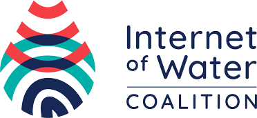

The Geoconnex project provides both **technical infrastructure and guidance** for implementing an open, community-contribution model for a knowledge graph linking hydrologic features in the United States, published in accordance with [Spatial Data on the Web best practices](https://www.w3.org/TR/sdw-bp/) as an implementation of [Internet of Water](https://github.com/opengeospatial/SELFIE/blob/master/docs/demo/internet_of_water.md) principles.

In short, Geoconnex aims to make water data as easily discoverable, accessible, and usable as possible. 

<i>
Please see the <a href="https://docs.geoconnex.us"> Geoconnex Docs</a> for more information on the project.
</i>

## Contributing

Please see the [Contributing](https://docs.geoconnex.us/contributing/overview) section of the [docs](https://docs.geoconnex.us) for instructions on how to add your data to Geoconnex.

## About this Repository

Geoconnex is a project made up of multiple system components. In order to make contribution to Geoconnex simpler, this repository contains **just the registry** for persistent identifiers for hydrologic features.

Other code repositories that contributors may not need to directly interact with and are internal Geoconnex infrastructure can be found on the [Geoconnex Code Repositories](https://docs.geoconnex.us/about/system-architecture/repositories) page and are located in the [Internet of Water Github Organization](https://github.com/internetofwater).

## Useful links

- [Geoconnex Intro](https://docs.geoconnex.us/about/intro)
- [Geoconnex SPARQL Playground](https://docs.geoconnex.us/playground/sparql)
- [Accessing Data in Geoconnex](https://docs.geoconnex.us/access/overview)
- [Geoconnex Code Repositories](https://docs.geoconnex.us/about/system-architecture/repositories)
- [Contributing to Geoconnex](https://docs.geoconnex.us/contributing/overview)
- [W3C / OGC Best Practices which Geoconnex Implements](https://docs.geoconnex.us/reference/overview)

## License

The contents of the geoconnex.us and all community contributions are <a href="https://creativecommons.org/publicdomain/zero/1.0/">public domain</a>

For more information, see the <a href="LICENSE.md">license</a>.
 
 

  
  

